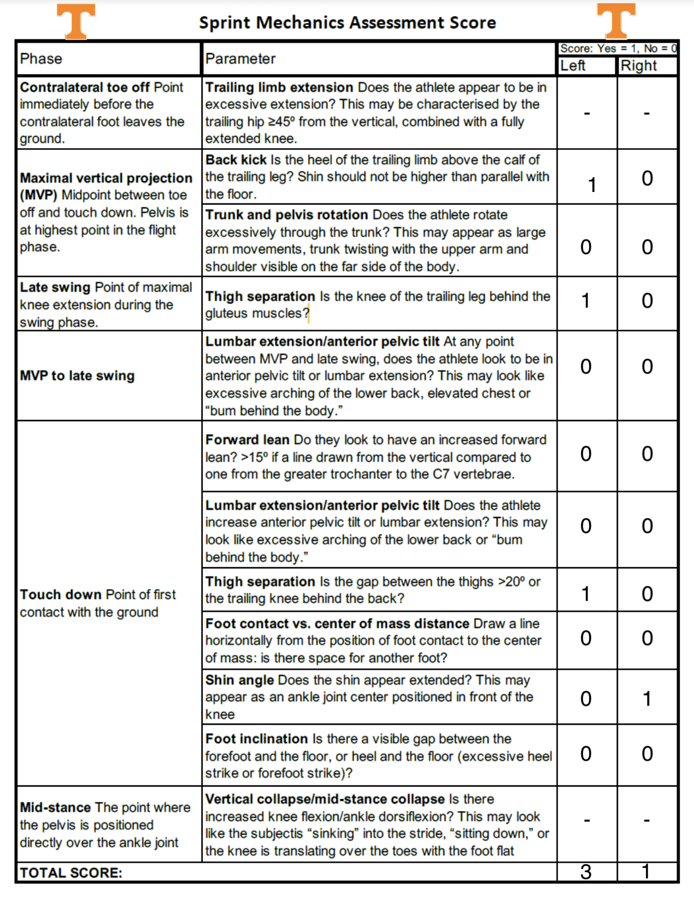
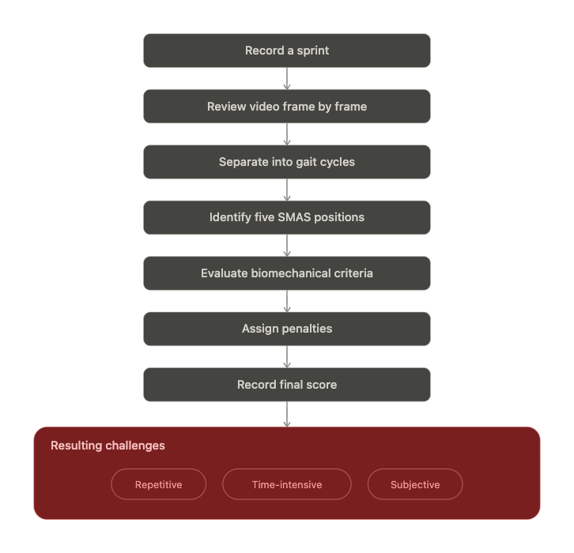
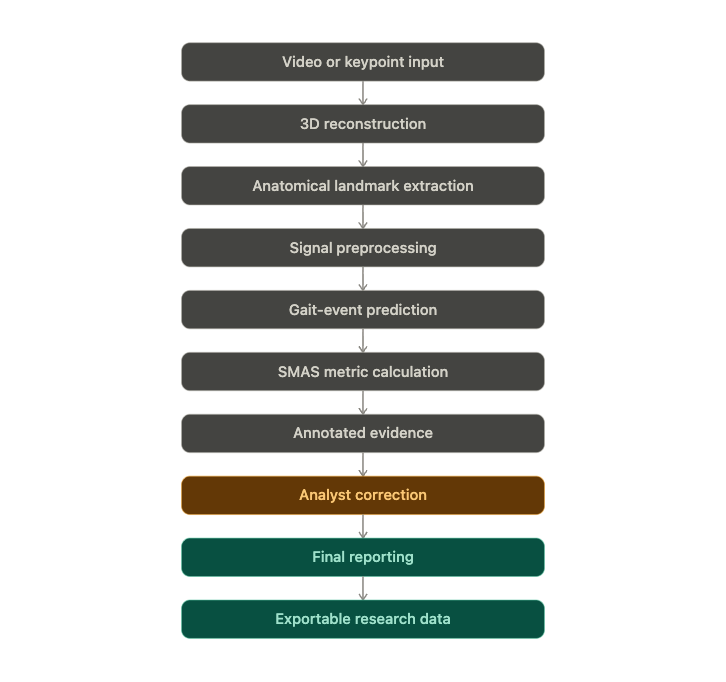
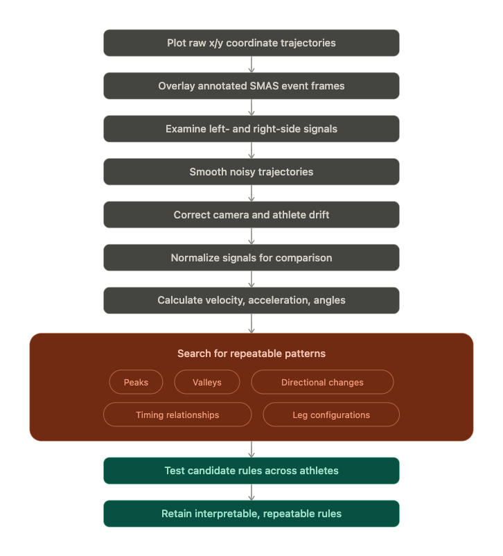
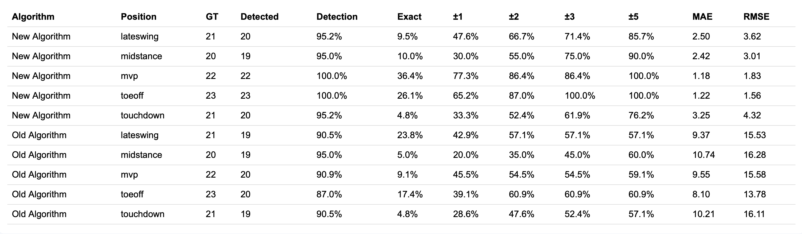

# Project Overview: Automated Event Detection, Scoring, and Analyst Review for Sprint Mechanics

**Author:** Mridula Venkatasamy
**3D reconstruction module:** Nan Xiao
**Partner:** University of Tennessee Football biomechanics staff

This document covers the research side of the project: why it exists, what SMAS is, how the event-detection method was developed and tested, the results, and where the work should go next. For how the code works, see [README.md](README.md).

---

## Contents

1. [Motivation](#1-motivation)
2. [What is SMAS?](#2-what-is-smas)
3. [The current manual workflow](#3-the-current-manual-workflow)
4. [Project goals and stakeholders](#4-project-goals-and-stakeholders)
5. [What makes this approach different](#5-what-makes-this-approach-different)
6. [System design](#6-system-design)
7. [Why not standard 2D pose estimation?](#7-why-not-standard-2d-pose-estimation)
8. [Dataset](#8-dataset)
9. [Method development](#9-method-development)
10. [Results](#10-results)
11. [Scoring criteria as implemented](#11-scoring-criteria-as-implemented)
12. [Contributions](#12-contributions)
13. [Limitations](#13-limitations)
14. [Future directions](#14-future-directions)

---

## 1. Motivation

UTK Football biomechanical analysts assess athletes with a range of drills. **Sprinting is one part of that evaluation**, and sprint mechanics can tell analysts about:

- movement quality,
- mechanical deficiencies,
- movement patterns that may be linked to injury,
- changes after training or rehabilitation.

Scoring sprint mechanics by hand is slow, repetitive, and subjective. This project automates most of the process while keeping the analyst in control of the final result.

---

## 2. What is SMAS?

The **Sprint Mechanics Assessment Score (S-MAS)** was introduced by **Dr. Christopher Bramah** as a qualitative framework for evaluating sprint-running mechanics.

- The original S-MAS has **12 scoring criteria**.
- Each criterion is scored **0** (deficiency not observed) or **1** (deficiency observed).
- The scores are added up. **Lower is better**: fewer mechanical deficiencies.

The criteria are judged at **five positions in each gait cycle**:

| Position | Definition |
|---|---|
| **Toe-Off** | The point immediately before the contralateral foot leaves the ground |
| **Maximum Vertical Projection (MVP)** | Mid-flight, when the pelvis is near its highest point |
| **Late Swing** | Maximal knee extension during swing |
| **Touchdown** | The first frame of ground contact |
| **Midstance** | The pelvis is directly over the stance ankle |

UTK's scoring sheet (scored separately for the left and right side):

Good mechanics vs. the deficiencies the score looks for:

| Desired | Deficiency |
|---|---|
| Appropriate trailing-limb position | Excessive trailing-limb extension |
| Controlled back-side mechanics | Excessive back kick |
| Limited touchdown overstride | Large thigh separation |
| Appropriate shin position | Foot too far ahead of the body |
| Controlled midstance posture | Knee collapsing forward during midstance |

---

## 3. The current manual workflow

Today an analyst records a sprint, steps through the video **frame by frame**, splits it into gait cycles, finds the five SMAS positions in each cycle by eye, judges every criterion, assigns penalties, and records a total. This is **repetitive, time-consuming, and subjective**. Different analysts, or the same analyst on different days, can choose different frames and reach different scores.

---

## 4. Project goals and stakeholders

### Goals

**Goal 1: Automate SMAS analysis.**
Detect gait cycles, predict the five SMAS event frames, calculate the scoring metrics, generate visual annotations, and produce an athlete report.

**Goal 2: Build a reusable research framework.**
Support different keypoint-generation systems, compare event-detection algorithms, store intermediate features and predictions, let future researchers replace individual modules, and **keep human review in the loop instead of forcing full automation**.

### Stakeholders

| UTK Football Team | Computer-vision & biomechanics researchers |
|---|---|
| Faster athlete evaluation | A rapid research-and-development framework |
| Consistent frame selection | Reusable data-processing modules |
| Clear visual explanations | Standardized output formats |
| The ability to review and correct results | Performance comparisons |
| Reports that support training decisions | Easy integration of improved pose models or detectors |

---

## 5. What makes this approach different

- **Automation combined with expert review.** The system proposes frames and scores. The analyst can change any of them.
- **Explainable.** Every score **traces back to a specific frame, measurement, threshold, and annotated image**, and each comes with a written reason.
- **Analyst overrides** at the level of a single metric, a whole criterion, or the final score. Analysts can also pick a different frame for any position and re-score it immediately.
- **Modular.** Any module can be replaced without rebuilding the rest of the system.

---

## 6. System design

**Keypoint-generation pipeline** (3D reconstruction module, provided by Nan Xiao):
- **3D human mesh recovery:** SAM3D-Body reconstructs a full-body mesh, and **MoGE-2** estimates focal length to improve the depth scale.
- **Trajectory refinement:** estimates the floor and sprint direction, reduces jitter, drift, foot sliding, and sideways motion, and applies **physics-based trajectory constraints**.
- **Keypoint extraction:** fits the **MHR skeleton** and derives **heel-contact, heel-tip, and toe-tip** landmarks.

**Analysis pipeline** (this project): load per-frame keypoints → preprocess the coordinate signals → detect the five gait events → calculate SMAS metrics → generate annotations → show results on an interactive website → export research and athlete-level outputs.

---

## 7. Why not standard 2D pose estimation?

Pretrained 2D pose-estimation models are useful, but sprinting is hard for them:

- rapid limb movement and **motion blur**,
- **self-occlusion** and **limbs crossing** in the side view,
- **left/right label switching**,
- standard skeletons **lack heel contact, heel tip, toe tip, and detailed foot joints**, and several SMAS criteria depend on exactly these.

This is why the project uses 3D mesh reconstruction with physically constrained trajectories and dedicated foot landmarks.

---

## 8. Dataset

**Ground-truth annotations**
- **5 manually selected SMAS event frames per gait cycle.** These are used to evaluate event detection and to compare scores from predicted frames with scores from ground-truth frames.
- **About 2,000 frames of lower-body keypoints**, hand-annotated in **Roboflow**.

**Reconstruction dataset**
- **60 FPS** video.
- **2 JSON files per athlete** (the lower-body JSON and the SMPL JSON described in the README), with lower-body joints, upper-body joints, and body-orientation vectors.

**Challenges**
- Hand-annotated keypoints can be **very noisy**.
- **Neighbouring frames can look almost identical, visually and biomechanically.** At 60 FPS consecutive frames are ~16.7 ms apart, so even expert annotators may disagree by a frame or two about exactly when an event happens. This matters when reading the "exact match" results below.

---

## 9. Method development

### 9.1 Establishing a baseline

Before building the current detector, a measurable baseline was needed:

1. Use the hand-annotated event frames as ground truth.
2. Run an initial **rule-based signal-processing detector** (the "Old Algorithm", `detect_old_algorithm` in the scoring core). It found Toe-Off where the detrended toe-height signal starts rising out of a valley, found Touchdown from heel and toe extrema, and then **derived** the other events: MVP as the Toe-Off/Touchdown midpoint, Late Swing as Touchdown − 2 frames, and Midstance as the heel minimum.
3. Compare its predictions with the ground-truth events.
4. Find which positions were detected consistently and which needed new logic.
5. Record **detection rate, frame error, mean absolute error, and tolerance-based accuracy**.

### 9.2 Exploratory signal analysis

The new algorithm was **developed empirically** through exploratory signal analysis:

Raw x/y joint trajectories were plotted with the annotated SMAS event frames on top. Left and right signals were examined, then smoothed, drift-corrected, and normalized. Velocity, acceleration, and angles were derived. Repeatable patterns (peaks, valleys, changes of direction, timing relationships, leg configurations) were then turned into candidate rules. Those rules were **tested across athletes**, and only the **interpretable, repeatable** ones were kept.

Examples of the patterns found. Each colored marker is a hand-labelled event:

| Left toe tip: vertical velocity | Left knee: normalized height | Left heel: normalized height |
|---|---|---|
|  |  |  |
| **MVP** (green) sits at the velocity peak | **Toe-Off** (purple) sits at the knee-height peak | **Midstance** (green) sits near the heel-height peak |

### 9.3 Signal preprocessing

Steps used by the **new** algorithm:
- **Gap filling:** missing keypoints are linearly interpolated.
- **Normalization:** the reference is the mean of the values above the 75th percentile of image *y*, roughly the joint's ground-level position. Then `normalized = reference − y`, so higher off the ground is positive.
- **Smoothing:** exponential moving average `sₜ = α·xₜ + (1 − α)·sₜ₋₁` with α = 0.3.
- **Derived features:** vertical velocity (EMA-smoothed gradient), acceleration, and the hip–knee–ankle leg angle.

Explored during development, but **not used by the current (new) algorithm**:
- **Drift correction** (removing a fitted linear trend). The scoring core computes it, but only the old baseline uses it.
- **Left/right correction** (keep vs. swap bilateral labels to minimize discontinuity). This is not in the scoring core, so label consistency currently relies on the 3D reconstruction. Because left and right candidates are merged before cycles are assembled (below), a label swap doesn't move the detected event frames.

### 9.4 The event-detection algorithm

| Event | Signal | Method | Parameters |
|---|---|---|---|
| Toe-Off | Normalized, EMA-smoothed knee vertical trajectory | Prominent local maxima | Min prominence 12% of range · min separation 10 frames |
| MVP | Toe vertical velocity | Prominent local maxima | Min prominence 12% of range · min separation 10 frames |
| Midstance | Normalized, EMA-smoothed heel vertical trajectory | Prominent local maxima | First valid candidate after Touchdown, before the next Toe-Off |
| Bilateral merging | Left/right candidates (any event) | Merge within a 6-frame window | Keep the candidate with higher prominence |

The peak finder also accepts a peak at the **first frame** and a peak **cut off by the end of the clip** (at 60% of the normal prominence), so events at the edges of short clips are not lost.

**Pairing events and completing the gait cycle**
- **Toe-Off ↔ MVP:** for each MVP, find an unused earlier Toe-Off that is 2–40 frames before it, and take the latest one that qualifies. A Toe-Off can only be assigned to one MVP.
- **Touchdown:** `swing interval = MVP − Toe-Off`, so `Touchdown = MVP + swing interval`. This assumes the flight phase is roughly symmetric around MVP.
- **Late Swing:** search between MVP and Touchdown, compute the left- and right-leg angles, keep the larger at each frame, and choose the frame where it is largest.
- **Midstance:** the first heel-signal candidate after Touchdown.
- **Edge handling:** if the projected Touchdown falls past the end of the video, that cycle keeps its Toe-Off and MVP, and Touchdown, Late Swing, and Midstance are flagged as missing for analyst review. A cycle without a matched Toe-Off/MVP pair is not reported.

---

## 10. Results

### 10.1 Event-detection accuracy vs. ground truth

| Algorithm | Position | GT events | Detected | Detection rate | Exact | ±1 | ±2 | ±3 | ±5 | MAE (frames) | RMSE (frames) |
|---|---|---|---|---|---|---|---|---|---|---|---|
| **New** | Toe-Off | 23 | 23 | **100.0%** | 26.1% | 65.2% | 87.0% | 100.0% | 100.0% | **1.22** | 1.56 |
| **New** | MVP | 22 | 22 | **100.0%** | 36.4% | 77.3% | 86.4% | 86.4% | 100.0% | **1.18** | 1.83 |
| **New** | Late Swing | 21 | 20 | 95.2% | 9.5% | 47.6% | 66.7% | 71.4% | 85.7% | 2.50 | 3.62 |
| **New** | Touchdown | 21 | 20 | 95.2% | 4.8% | 33.3% | 52.4% | 61.9% | 76.2% | 3.25 | 4.32 |
| **New** | Midstance | 20 | 19 | 95.0% | 10.0% | 30.0% | 55.0% | 75.0% | 90.0% | 2.42 | 3.01 |
| Old | Toe-Off | 23 | 20 | 87.0% | 17.4% | 39.1% | 60.9% | 60.9% | 60.9% | 8.10 | 13.78 |
| Old | MVP | 22 | 20 | 90.9% | 9.1% | 45.5% | 54.5% | 54.5% | 59.1% | 9.55 | 15.58 |
| Old | Late Swing | 21 | 19 | 90.5% | 23.8% | 42.9% | 57.1% | 57.1% | 57.1% | 9.37 | 15.53 |
| Old | Touchdown | 21 | 19 | 90.5% | 4.8% | 28.6% | 47.6% | 52.4% | 57.1% | 10.21 | 16.11 |
| Old | Midstance | 20 | 19 | 95.0% | 5.0% | 20.0% | 35.0% | 45.0% | 60.0% | 10.74 | 16.28 |

**How to read this table**
- **GT events:** how many ground-truth instances of that position were annotated.
- **Detected:** how many the algorithm predicted.
- **Exact / ±k:** the share of ground-truth events where the prediction was within *k* frames. At 60 FPS, ±1 frame ≈ ±17 ms and ±5 frames ≈ ±83 ms.
- **MAE / RMSE:** mean absolute error and root-mean-square error, in frames. When RMSE is much larger than MAE, a few predictions were far off.

**How the comparison was made** (`build_prediction_performance_payload` in the scoring core):
- Per athlete, the *i*-th ground-truth event of a position is paired with the *i*-th predicted frame of that position (both in time order). They are not matched by nearest frame.
  - A **missed** early event therefore shifts every later pairing for that athlete and inflates the error. This probably explains part of the old algorithm's large RMSE.
  - **Extra predictions (false positives) are ignored.** "Detected" counts ground-truth events that received a paired prediction, so the detection rate does not penalize false positives.
- The scoring core reports exact-match accuracy, MAE, and RMSE. The ±k tolerance columns were aggregated outside this code.

### 10.2 Key findings

- **Mean error dropped by about 4.5×.** Averaged over the five positions (unweighted), MAE fell from **~9.6 frames (old) to ~2.1 frames (new)**, i.e. from ~160 ms to ~35 ms at 60 FPS. RMSE fell from ~15.5 to ~2.9 frames.
- **Large misses mostly disappeared.** The old algorithm's RMSE was about 1.6× its MAE, a sign of occasional very wrong predictions. For the new algorithm the two are close, so its errors are small and consistent.
- **Within-5-frames accuracy rose from ~59% to ~90%** (unweighted mean across positions). **Toe-Off and MVP are within ±5 frames 100% of the time**, and Toe-Off is within ±3 frames 100% of the time.
- **Detection rate improved to 95–100%** for every position, up from 87–95%.
- **The events that are detected directly (Toe-Off, MVP) are the most accurate.** Touchdown is *projected* from the Toe-Off → MVP interval, so its error builds on theirs and it is the least accurate event (MAE 3.25, 76.2% within ±5). Late Swing and Midstance are searched relative to Touchdown, so they carry some of that error too.
- **Exact-frame matches are still uncommon for later events**, and the old algorithm had more exact Late Swing hits (23.8% vs. 9.5%). Neighbouring frames are nearly the same (Section 8), so ±1–2 frame accuracy is the more meaningful measure. The analyst can also move any frame with the Previous/Next controls.

### 10.3 Not yet reported

The dataset was also set up to **compare the SMAS score from predicted frames with the score from ground-truth frames**, i.e. whether frame errors change the final score. The scoring core already computes this: in standalone mode, `score_comparison` in `smas_scoring_payload.json` holds both scores and the penalized criteria for each (README §16). Those results are not summarized in this document yet, and they are a natural next evaluation.

---

## 11. Scoring criteria as implemented

| Event | Criterion | Measurement | Threshold | Type |
|---|---|---|---|---|
| Toe-Off | Trailing heel–midhip angle | Midhip-to-heel angle relative to vertical | Target 45° · pass range 40°–50° (angles below 40° are also penalized) | Automatic |
| MVP | Back kick | Trailing heel height relative to the trailing knee | Pass if the heel is > 5% of body span below the knee line | Automatic |
| MVP | Trunk and pelvic rotation | Chest vs. sprint direction; pelvis vs. sprint direction; chest-to-pelvis separation | \|Chest-to-pelvis rotation\| > 20° (provisional) | Automatic |
| Late Swing | Trailing-knee position | Trailing knee position relative to its hip line | Pass if the knee is ≥ 4% of body span in front of the hip | Automatic |
| Late Swing | Lumbar extension / anterior pelvic tilt | Signed trunk-curvature angle; trailing-hip position vs. pelvis; forward trunk lean | Review suggested if bend > 12° and trailing hip > 0.10 torso lengths behind the pelvis* | Analyst-reviewed |
| Touchdown | Forward lean | Pelvis-to-neck trunk angle relative to vertical | −2° ≤ forward lean ≤ 15° | Automatic |
| Touchdown | Lumbar extension / anterior pelvic tilt | Same as Late Swing | Analyst confirms before any penalty | Analyst-reviewed |
| Touchdown | Thigh separation | Angle between the two midhip-to-knee vectors | Target 20° · pass ≤ 25° | Automatic |
| Touchdown | Shin position | Front ankle distance ahead of the front knee | Pass if ≤ 4% of body span | Automatic |
| Touchdown | Foot-to-centre-of-mass distance | Front-foot horizontal position vs. midhip, normalized by foot length | Penalize if > 1.25 foot lengths ahead | Automatic |
| Midstance | Knee-to-toe position | Stance-knee horizontal position vs. a vertical line through the toe tip | Pass if ≤ 3% of body span ahead of the toe | Automatic |

"Body span" is the vertical pixel extent of the lower-body keypoints in that frame (with a minimum threshold of 8 px). Using it makes the pixel thresholds scale with the athlete's size in the image. Exact formulas are in README §7.

\* The presentation lists the lumbar trigger as "bend > 12° **or** trailing hip > 0.10". The code uses **and** (both must hold). Either way it only *suggests* a review and never adds a point on its own.

Lumbar extension is left to the analyst on purpose. The available keypoints **cannot directly measure anterior pelvic tilt**, so the system shows supporting measurements and an annotated image and lets the analyst decide.

---

## 12. Contributions

- Combined 3D sprint reconstruction with SMAS analysis.
- Developed an **interpretable five-event detection algorithm**. It cut mean frame error by about 4.5× compared with the baseline.
- Turned the lower-body SMAS criteria into computable metrics.
- Created **annotated visual explanations** for every metric.
- Built an **analyst-review interface** with overrides, notes, frame re-selection, and missing-event handling.
- Produced reusable **CSV, JSON, image, and HTML outputs**.
- Created a **framework where future algorithms can be compared and swapped in**.

---

## 13. Limitations

- **Depends on keypoint quality.** Errors in the reconstruction carry through to event detection and metrics.
- **SMAS is subjective by nature.** Ground-truth frames and scores reflect human judgement, and adjacent frames are often equally valid.
- **Occlusion and crossed limbs** in the side view remain difficult.
- **Scoring thresholds need more validation**, especially the provisional trunk-rotation and lumbar-review thresholds.
- **3D reconstruction is not real-time.** It needs a GPU and takes a long time per video.
- Evaluation so far uses about **20–23 annotated instances per position**, and pairs events by order rather than by nearest frame (§10.1). A larger dataset and a nearest-match evaluation that also counts false positives would give stronger conclusions.
- If a required keypoint is missing, the lower-body metrics currently record a **penalty**, which the analyst must review.
- The app scores each criterion once per athlete and **does not yet score left and right sides separately**, unlike the paper scoring sheet. **Foot inclination** is not implemented yet.

---

## 14. Future directions

- **Manual keypoint correction** in the interface.
- **Automate the remaining trunk and pelvis metrics** (lumbar extension / anterior pelvic tilt).
- **Reduce reconstruction runtime.**
- **Replace or improve the event-detection algorithm.** The modular design lets a new detector plug in and be benchmarked with the same metrics as Section 10.
- **Store analyst corrections in the database and use them as training data.** Analyst-selected frames and overrides are already saved per run.
- **Let new pose-estimation and event-detection modules plug into the same pipeline.**
- Report **predicted-frame vs. ground-truth-frame scoring agreement** (Section 10.3).
- Calibrate provisional thresholds against **coach-labelled examples**.
- Re-run the evaluation with **nearest-frame matching and false-positive counts**.
- Add the **left/right label correction** step to the scoring core, if the reconstruction doesn't already guarantee consistent labels.
