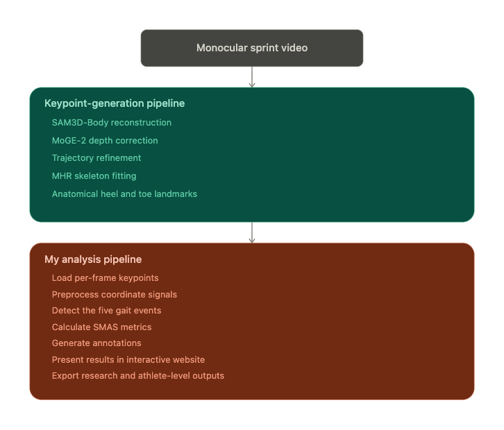
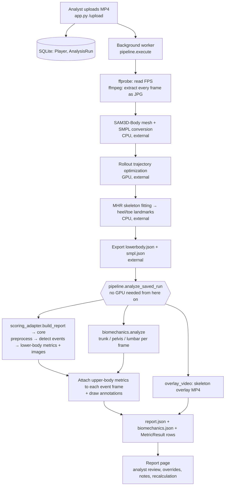
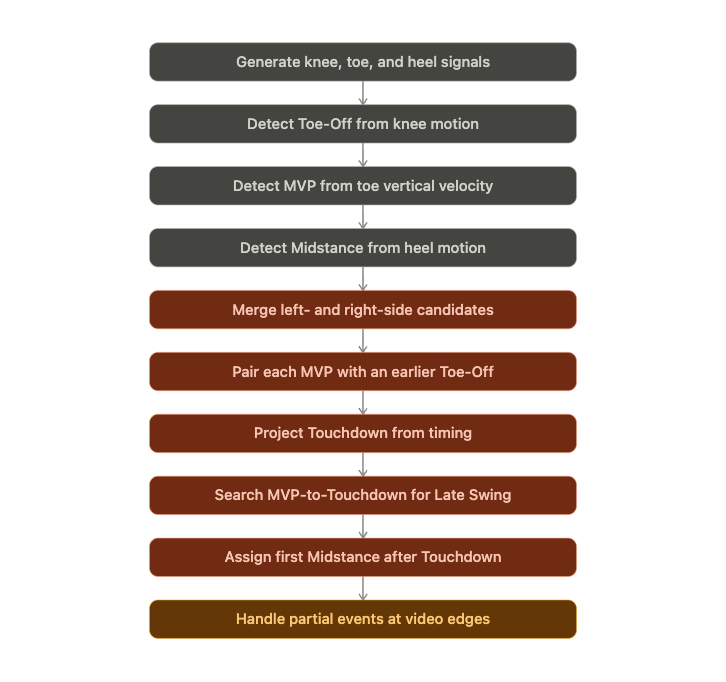
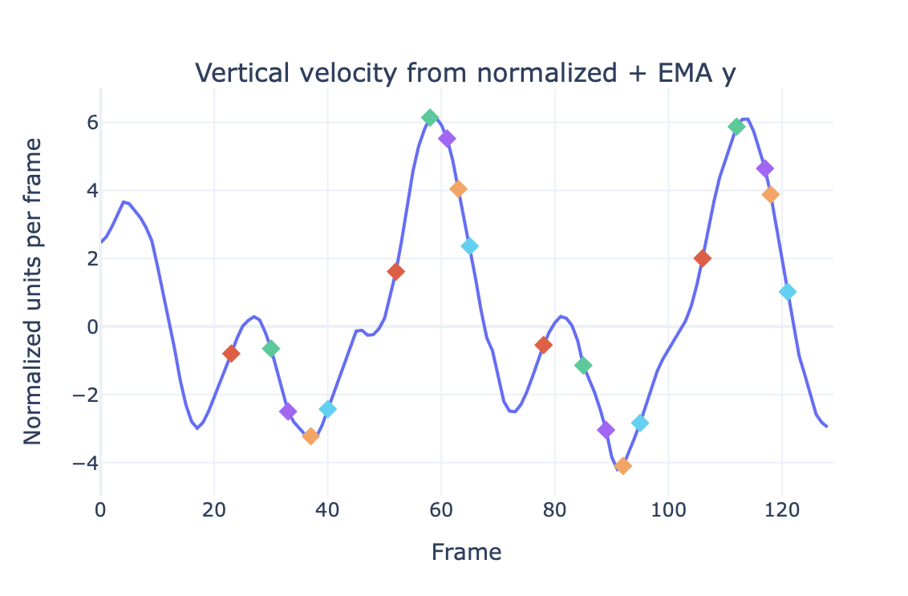
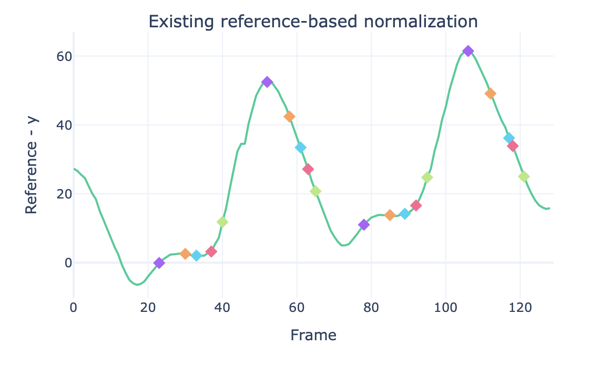
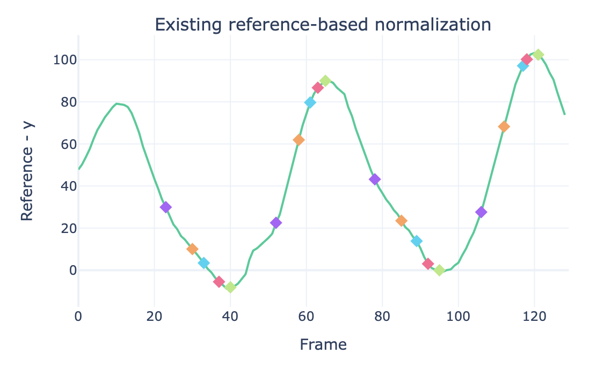
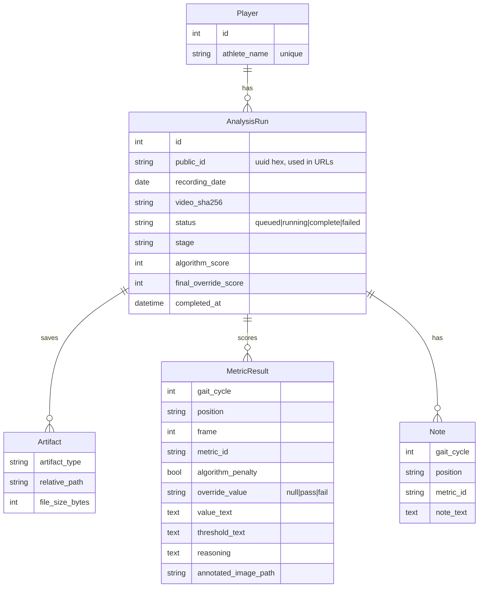

# SMAS Sprint Analysis Web App

This web app automates the **Sprint Mechanics Assessment Score (SMAS)**. An analyst uploads a sprint video of an athlete. The app then:

1. rebuilds the athlete's 3D body motion from that single video,
2. finds the five SMAS event frames (Toe-Off, MVP, Late Swing, Touchdown, Midstance) in every gait cycle,
3. measures each SMAS criterion on those frames and draws the measurement onto the image,
4. shows everything in a report where the analyst can review it, override it, pick different frames, and add notes.

It was built for the University of Tennessee Football biomechanics staff. It is also meant as a research framework, so each stage (pose model, event detector, metrics) can be swapped out without rebuilding the rest.

> **Reading guide**
> - This file covers **how the code works**: architecture, pipeline, the event-frame detection algorithm, every metric, scoring, data formats, setup, and known issues.
> - **[PROJECT_OVERVIEW.md](PROJECT_OVERVIEW.md)** covers **the research project**: motivation, SMAS background, dataset, method development, results, and future work.

---

## Table of contents

1. [What is and isn't in this repository](#1-what-is-and-isnt-in-this-repository)
2. [Repository layout](#2-repository-layout)
3. [Architecture at a glance](#3-architecture-at-a-glance)
4. [What happens when a video is uploaded](#4-what-happens-when-a-video-is-uploaded)
5. [Frame extraction and frame numbering](#5-frame-extraction-and-frame-numbering)
6. [Event-frame detection: how the five SMAS positions are found](#6-event-frame-detection-how-the-five-smas-positions-are-found)
7. [Metrics: how each SMAS criterion is measured](#7-metrics-how-each-smas-criterion-is-measured)
8. [Scoring rules](#8-scoring-rules)
9. [The report page and analyst review tools](#9-the-report-page-and-analyst-review-tools)
10. [Data formats](#10-data-formats)
11. [Database schema](#11-database-schema)
12. [On-disk layout of an analysis run](#12-on-disk-layout-of-an-analysis-run)
13. [HTTP routes](#13-http-routes)
14. [Configuration](#14-configuration)
15. [Installation, running, and testing](#15-installation-running-and-testing)
16. [Using the scoring core on its own (research / evaluation mode)](#16-using-the-scoring-core-on-its-own-research--evaluation-mode)
17. [Module reference](#17-module-reference)
18. [Known issues and handoff notes](#18-known-issues-and-handoff-notes)
19. [How to extend the system](#19-how-to-extend-the-system)

---

## 1. What is and isn't in this repository

**Included:**
- The web app.
- The pipeline orchestration.
- The **SMAS scoring core** (`core/smas_scoring_logic.py`), which holds signal preprocessing, the event-detection algorithm, the old baseline algorithm, all lower-body metrics, their annotations, and the evaluation code.
- The upper-body/trunk metrics.

**Not included:** the 3D reconstruction step that turns a video into keypoints. It is external research code on the lab GPU server (`/data/marci/mvenkat4/...`):

| External component | Default location (see `config.py`) | What the app uses it for |
|---|---|---|
| **Athlete_Mesh_Analysis_Codes** | `/data/marci/mvenkat4/Athlete_Mesh_Analysis_Codes` | Shell scripts that run the reconstruction (`scripts/run_sam3d_mhr_smpl.sh`, `scripts/run_rollout_all_athletes.sh`, `scripts/run_mhr_kpts.sh`) and the JSON exporter (`export/export_lowerbody.py`) |
| **SAM3D-Body** | `/data/marci/mvenkat4/sam-3d-body` | 3D human mesh recovery from each frame |
| **MHR** | `/data/marci/mvenkat4/MHR` | Skeleton fitting, including heel and toe landmarks |
| **SMPL model file** | `.../SMPL_N_model_generate_from_npz.pkl` | Body model used during mesh conversion |
| **Conda environment** `sam_3d_body` | `/data/marci/mvenkat4/miniconda3` | Python environment for the steps above |

The 3D reconstruction module (SAM3D-Body + MoGE-2 + trajectory refinement + MHR keypoints) was provided by **Nan Xiao**. The analysis pipeline, the event detector, the metrics, and this web app were built by **Mridula Venkatasamy**.

Everything after the reconstruction step runs **without a GPU** from two JSON files per video (Section 10). You can develop and test the detector, the metrics, and the web app on a laptop (Section 15).

---

## 2. Repository layout

```
.
├── app.py                 Flask web app: login, upload, status polling, report page, review APIs
├── pipeline.py            Background job: video → reconstruction → analyze_saved_run() → report
├── scoring_adapter.py     Bridge between the app and the scoring core
├── core/
│   └── smas_scoring_logic.py
│                          SMAS scoring core: preprocessing, event detection (new + old baseline),
│                          lower-body metrics, annotations, evaluation, standalone HTML report
├── biomechanics.py        Upper-body / trunk metrics (rotation, forward lean, lumbar review) + their annotations
├── overlay_video.py       Renders the skeleton-overlay video
├── models.py              SQLAlchemy database models
├── config.py              All paths, credentials, and limits (every value can be overridden by env var)
├── reanalyze.py           CLI: re-score saved runs without the GPU (e.g. after a threshold change)
├── tests/
│   └── smoke_test.py      End-to-end test on synthetic data (no GPU needed)
├── templates/             Jinja/HTML pages (see Section 9)
├── docs/images/           Diagrams and result figures used in the documentation
├── requirements-web.txt   Python dependencies
├── .env.example           Every configurable environment variable
├── CHANGELOG.md
├── README.md              (this file)
└── PROJECT_OVERVIEW.md    Research background, methods, and results
```

---

## 3. Architecture at a glance



The system has two halves:

- **Keypoint-generation pipeline (external):** turns a monocular (single-camera) sprint video into per-frame 3D body keypoints, including foot landmarks (heel contact, heel tip, toe tip) that standard 2D pose models lack.
- **Analysis pipeline (this repo):** loads those keypoints, cleans the signals, detects the five gait events, computes SMAS metrics, draws annotations, and serves the interactive report.



---

## 4. What happens when a video is uploaded

### 4.1 Upload (`app.py → upload()`)

1. The analyst logs in (one shared account; see Section 14) and fills in **athlete name**, **recording date**, and an **MP4 file** on the dashboard.
2. The athlete name is cleaned up: whitespace becomes `_`, and only `A–Z a–z 0–9 _ -` are allowed.
3. The video is saved to a temporary file and its **SHA-256 hash** is computed.
4. **Duplicate check:** if a run already exists with the same athlete, recording date, and video hash, and its status is `queued`, `running`, or `complete`, the app shows `duplicate.html` with a link to that report and does not reprocess. A failed run never blocks a retry.
5. Otherwise the app creates `instance/player_data/<public_id>/input/original_video.mp4`, inserts an `AnalysisRun` row with status `queued`, and hands the job to the background worker.
6. The browser goes to `status.html`, which polls `/api/runs/<id>` every 3 seconds and opens the report when the job finishes.

### 4.2 Background job (`pipeline.py → execute()`)

Jobs run on a **single-thread `ThreadPoolExecutor`**, so only one video is processed at a time. Later uploads wait in the queue. Each stage updates `AnalysisRun.stage`, which is the text on the status page. All output from external commands goes to `<run>/pipeline.log`.

**Pipeline key.** The external scripts find their inputs and outputs by name. Each run passes them a unique **pipeline key**, `<athlete>_<first 8 chars of public_id>` (for example `Jane_Doe_3f9a1c2b`), so two videos of the same athlete never share or reuse each other's reconstruction. The key is saved in `report.json → pipeline_key`.

| # | Status text shown to user | What runs | Device |
|---|---|---|---|
| 1 | *Preparing video for analysis* | Copy the video to `SPRINT_VIDEOS_DIR/<key>.mp4`, where the external scripts look for it. `ffprobe` reads the real frame rate. | – |
| 2 | *(same)* | `ffmpeg` extracts **every frame** at the source FPS into `<run>/frames/000001.jpg, …` (Section 5) | CPU |
| 3 | *Estimating the athlete mesh* | `scripts/run_sam3d_mhr_smpl.sh <key>`: SAM3D-Body reconstructs a 3D mesh per frame (MoGE-2 supplies focal length and depth scale), then converts it to SMPL | CPU |
| 4 | *Optimizing the athlete motion* | `scripts/run_rollout_all_athletes.sh <key>`: physics-based trajectory refinement. Estimates the floor and sprint direction, and reduces jitter, drift, foot sliding, and sideways motion | **GPU** |
| 5 | *Building detailed lower-body landmarks* | `scripts/run_mhr_kpts.sh <key>`: fits the MHR skeleton and derives heel-contact, heel-tip, and toe-tip landmarks | CPU |
| 6 | *Creating the analysis report* | `conda run -n sam_3d_body python export/export_lowerbody.py --athlete <key>` writes `SMPL_JSON_DIR/<key>.json` and `LOWERBODY_JSON_DIR/<key>.json` | CPU |
| 7 | *(same)* | Both JSONs are copied into the run as `datasets/smpl.json` and `datasets/lowerbody.json`, so the run is self-contained | – |
| 8 | *(same)* | **`analyze_saved_run()`** does everything below, using only files inside the run folder | CPU |
| 8a | | `build_report()`: event detection, lower-body metrics, and annotated images via the scoring core (Sections 6 and 7.1) | |
| 8b | | `analyze()`: per-frame trunk/pelvis measurements (Section 7.2) | |
| 8c | | **Frame-count alignment check**: compares the number of extracted images, lower-body frames, and SMPL frames. Mismatches become a warning banner on the report | |
| 8d | | For each event, `metrics_for_position()` computes the upper-body metrics and `draw_upper_annotation()` draws them | |
| 8e | | `create_skeleton_overlay()` draws the 2D skeleton on every frame and encodes `video/skeleton_overlay.mp4` | |
| 8f | | `validate_report_images()`: **the run fails** if any image the report refers to does not exist, so a "complete" report never has empty image cards | |
| 8g | | Writes `report.json` and `biomechanics.json`. Replaces the run's `MetricResult` and `Artifact` rows. Sets `algorithm_score` | |
| 9 | *Analysis complete* | Marks the run complete | – |

If any stage raises an error, the traceback goes to `<run>/traceback.txt`, the run is marked `failed`, and the error message appears on the status page. **If the server restarts mid-job**, the job is lost (the queue is in memory). At the next startup, any run still `queued` or `running` is marked failed with an explanation, so it can be re-uploaded.

Every external stage gets these environment variables: `SAM3D_DIR`, `MHR_DIR`, `SMPL_MODEL`, `DATASET_DIR` (= `SPRINT_VIDEOS_DIR`), `ROLLOUT_ROOT`, `CONDA_EXE`, `CUDA_VISIBLE_DEVICES`, `PYOPENGL_PLATFORM=egl`, `SKIP_EXISTING=1`, `PROCESSING_FPS` (the measured source FPS), `INPUT_VIDEO`, `FRAME_DIR`, plus `DEVICE=cpu|cuda`. Each runs with its working directory set to `ATHLETE_CODES_DIR`.

---

## 5. Frame extraction and frame numbering

**How frames are extracted.** `pipeline.py` calls:

```bash
ffprobe -v error -select_streams v:0 -show_entries stream=avg_frame_rate ...   # e.g. "60000/1001" → 59.94
ffmpeg -y -i original_video.mp4 -vf fps=<source_fps> -q:v 2 frames/%06d.jpg
```

- The FPS comes from the video itself (`probe_video_fps`) and is **not assumed**. It must fall between 1 and 240, otherwise the run fails. The development dataset was **60 FPS**.
- Passing `fps=<source_fps>` means ffmpeg keeps every original frame and does not resample.
- `-q:v 2` gives high-quality JPEGs, which the annotations are drawn on.
- The same FPS is passed to the external pipeline (`PROCESSING_FPS`) and used to encode the overlay video, so all timelines match.

**Frame numbering convention.** This causes off-by-one bugs easily, so keep it in mind:

| Thing | Indexing | Example |
|---|---|---|
| Motion data frames (`lowerbody.json`, `smpl.json`, `biomechanics.json`, the core's `df["frame"]`) | **0-based** | frame `0` |
| ffmpeg image filenames | **1-based**, 6 digits | `000001.jpg` |
| "Frame N" in the report and its dropdowns | **0-based** (motion frame) | "Frame 0" = `000001.jpg` |
| `sorted(frames.glob("*.jpg"))[i]` in Python | 0-based list index | index `0` = `000001.jpg` |

On its own, the scoring core names images with **5 digits** (`00001.jpg`). `scoring_adapter.py` overrides this: it sets `df["file_name"] = f"{frame+1:06d}.jpg"` and `core.IMAGE_FRAME_OFFSET = 1` so the core finds ffmpeg's 6-digit files.

**Alignment check.** After export, the pipeline counts extracted JPGs, the length of every lower-body joint's `pixel_uv` array, and the SMPL frame count. Any disagreement shows up as a **Frame alignment warning** banner on the report, with the counts saved in `report.json → alignment`. `biomechanics.analyze()` uses only the frames present in both JSONs, so a mismatch produces a warning instead of a failed run.

---

## 6. Event-frame detection: how the five SMAS positions are found

> **Code:** `core/smas_scoring_logic.py`: `add_feature_columns_for_prediction()` (features) and `detect_new_algorithm()` (detection). `scoring_adapter.build_report()` calls them. Every tunable parameter is a constant at the top of the file (`NEW_*`, `BILATERAL_MERGE_WINDOW`, `EMA_ALPHA`).
>
> **How it was designed:** empirically. Raw joint trajectories were plotted with the hand-labelled event frames overlaid, repeatable patterns were found, candidate rules were tested across athletes, and only interpretable, repeatable rules were kept (see PROJECT_OVERVIEW.md).

### 6.1 The five positions (per gait cycle)

| Key | Position | Definition |
|---|---|---|
| `toeoff` | **Toe-Off** | The point immediately before the contralateral foot leaves the ground |
| `mvp` | **Maximum Vertical Projection** | Mid-flight, when the pelvis is near its highest point |
| `lateswing` | **Late Swing** | Maximal knee extension of the swing leg, before contact |
| `touchdown` | **Touchdown** | The first frame of ground contact |
| `midstance` | **Midstance** | The pelvis is directly over the stance ankle |

`detect_new_algorithm(df)` returns a list of cycles like `{"toeoff": 23, "mvp": 30, "lateswing": 33, "touchdown": 37, "midstance": 40}`. The last three can be `None`.

### 6.2 Step 1: Load and map joints (`load_motion_json`)

The lower-body JSON's `pixel_uv` coordinates (image pixels, *y* pointing **down**) become a table with one row per frame and `<joint>_x`, `<joint>_y` columns. The reconstruction's joint names are mapped to readable names (`JOINT_MAP`):

| Readable name | JSON joint | | Readable name | JSON joint |
|---|---|---|---|---|
| `left_hip` / `right_hip` | `l_upleg` / `r_upleg` | | `left_toe` | `l_toe_tip` |
| `left_knee` | `l_lowleg` | | `left_heel` | `l_heel_tip` |
| `left_ankle`, `left_foot` | `l_foot` | | `midhip` | mean of the two hips |

### 6.3 Step 2: Build signals (`add_feature_columns_for_prediction`)

For **every** joint, the core computes these from the vertical coordinate *y*:

1. **Gap filling** (`fill_nan`): missing values (NaN) are linearly interpolated, then forward/back-filled at the ends.
2. **Reference normalization** (`normalize_one_signal`): the **reference** is the mean of the values **above the 75th percentile** of *y*, which is roughly the joint's lowest position in the image because *y* points down. Then `normalized = reference − y`, so **larger values mean higher off the ground** and the baseline sits near 0. This makes athletes and camera distances comparable.
3. **Smoothing** (`ema`): an exponential moving average `sₜ = α·xₜ + (1 − α)·sₜ₋₁` with **α = 0.3**, giving `<joint>_y_reference_normalized_ema`.
4. **Vertical velocity**: `np.gradient` of the smoothed normalized signal, then smoothed again with the same EMA, giving `<joint>_y_velocity`. Positive means moving **up**. Acceleration is the gradient of that.
5. **Leg angle** (per side): the interior **hip–knee–ankle angle** (`calculate_three_point_angle`). 180° is a straight leg.

The core also computes **linearly detrended** versions (`_y_detrended_ema`, `_y_detrended_norm_ema`). **Only the old baseline algorithm uses them**; the new algorithm does not.

> **Correction to the project slides.** The presentation lists a "left/right correction (keep vs. swap)" step and drift correction as preprocessing. **Neither is done by the new algorithm in this core.** There is no left/right swap logic in the file, and detrending feeds only the old baseline. Left/right label consistency currently depends on the upstream 3D reconstruction. Merging the two legs' candidates (Step 4) also means a left/right swap doesn't change the *event* frames, only which side the metrics pick.

### 6.4 Step 3: Find candidate peaks (`prominent_maxima`)

Each event is a **prominent local maximum** in one signal:

| Event | Signal (both legs, separately) | What the peak most likely corresponds to (interpretation) |
|---|---|---|
| **Toe-Off** | knee `y_reference_normalized_ema` | The swing knee is at its highest (knee drive) at the moment the other foot leaves the ground |
| **MVP** | toe-tip `y_velocity` | The recovering foot is rising fastest, in mid-flight |
| **Midstance** | heel `y_reference_normalized_ema` | The swing-side heel is folded highest under the body while the stance leg is at midstance |

For each signal:

1. **Main peaks:** `scipy.signal.find_peaks` with
   - `prominence ≥ 12% of the signal's range` (`NEW_*_PROMINENCE_PCT = 0.12`). "Prominence" is how far a peak rises above the surrounding valleys, so small noise wiggles are ignored whatever the athlete's size or distance.
   - `distance ≥ 10 frames` (`NEW_PEAK_DISTANCE`, ≈ 0.17 s at 60 FPS), so one event can't be detected twice.
   - `width ≥ 1` (`NEW_PEAK_WIDTH`).
2. **Peak at the very first frame:** `find_peaks` can't detect a peak at index 0. So frame 0 is also a candidate if it is higher than every value in the next 4 frames (`NEW_BOUNDARY_PEAK_WINDOW`) and stands out by the required prominence.
3. **Peak cut off by the end of the video:** in the last 15 frames (`NEW_END_PEAK_SEARCH_WINDOW`), the highest point is also a candidate if nothing after it is higher and it rises at least **60%** (`NEW_END_PEAK_PROMINENCE_MULTIPLIER`) of the required prominence above the minimum of the 10 frames before it (`NEW_END_PEAK_BASELINE_WINDOW`). This catches events whose peak is cut short by the end of the clip.
4. **Clean-up:** candidates are sorted by prominence, and a candidate is kept only if it is ≥ 10 frames from every stronger one already kept (non-maximum suppression).

### 6.5 Step 4: Merge left and right (`merge_bilateral`)

The left-leg and right-leg candidates for one event type are pooled and sorted by frame. Consecutive candidates **≤ 6 frames apart** (`BILATERAL_MERGE_WINDOW`) form a group, and the grouping chains, so 10, 15, and 20 all end up in one group. Each group keeps its **most prominent** frame. The result is one list of Toe-Off, MVP, and Midstance frames for the whole video, each event being whichever leg produced the stronger peak.

### 6.6 Step 5: Assemble gait cycles (`detect_new_algorithm`)



MVP is the most reliable event (100% detected in validation), so **each cycle is built around an MVP**:

1. **Pair Toe-Off → MVP.** For each MVP, in time order, consider the Toe-Offs that are **not yet used** and fall **2–40 frames earlier** (`NEW_PAIR_MIN_GAP`, `NEW_PAIR_MAX_GAP`). Take the **latest** one and mark it used.
   - An MVP with no such Toe-Off is **dropped**, and so is a Toe-Off with no MVP. So **every reported cycle has a Toe-Off and an MVP.** A partial stride at the start of the video, before the first detected Toe-Off, is not reported.
2. **Touchdown from timing.** Flight is roughly symmetric around mid-flight, so:
   ```
   Touchdown = MVP + (MVP − ToeOff)
   ```
   If that frame is **past the end of the video**, Touchdown, Late Swing, and Midstance are all set to `None` for that cycle. It appears in the report as a cycle with missing positions.
3. **Late Swing** (`detect_lateswing_frame`). Over frames `MVP … Touchdown` (inclusive), take the larger of the left and right hip–knee–ankle angles at each frame. Late Swing is the frame where that value is **largest**, i.e. the swing leg is most extended.
4. **Midstance.** The **first merged Midstance candidate at or after Touchdown** and **before the next cycle's Toe-Off**. If there isn't one, it is `None`.

The signals below (from the project slides) show the patterns these rules rely on. Each colored marker is a **hand-labelled** event on a left-side joint:

| Left toe tip: vertical velocity | Left knee: normalized height | Left heel: normalized height |
|---|---|---|
|  |  |  |
| MVP (green) sits at the velocity peak. Toe-Off = red, Late Swing = purple, Touchdown = orange, Midstance = blue | Toe-Off (purple) sits at the knee-height peak. MVP = orange, Late Swing = blue, Touchdown = red, Midstance = green | Midstance (green) sits near the heel-height peak. Colors as in the knee plot |

### 6.7 Step 6: From cycles to the report

`build_report()` converts the cycles into an events table (`gait_cycle, position, frame, frame_source="new_algorithm"`) and calls `core.build_scoring_payload()`. For **each detected position**, that function evaluates the position's metrics and draws annotations **on the event frame and on every frame within ±5 of it** (`FRAME_WINDOW`), saving them under `frame_candidates` and `frames` in `report.json`. Positions with no frame get `missing: true`. The adapter then turns the core's `file://` image paths into run-relative paths the web app can serve.

### 6.8 The old baseline algorithm (`detect_old_algorithm`)

It is kept for comparison (results in PROJECT_OVERVIEW.md) and is **not used for scoring**:
- **Toe-Off:** valleys of the detrended, normalized toe-height signal, followed forward to the first frame where the toe starts rising consistently (a 3-frame mean slope above a noise floor), then refined with 1st/2nd-derivative scores.
- **Touchdown:** the first minimum of the detrended heel image-*y* signal after Toe-Off, minus 2 frames, averaged with the first toe-height maximum if the two agree within 5 frames.
- **MVP** = midpoint of Toe-Off and Touchdown. **Late Swing** = Touchdown − 2. **Midstance** = that heel minimum.

---

## 7. Metrics: how each SMAS criterion is measured

Every metric produces the same dictionary: `metric_id`, `metric_label`, `frame`, `penalty` (bool), `value_text`, `threshold_text`, `reasoning`, `annotated_image`. The core also adds `score`/`passed`, and `biomechanics.py` adds `review_required`/`review_suggested`. **Every score can be traced to a frame, a measured value, a threshold, and an annotated image.**

### 7.1 Lower-body metrics (`core/smas_scoring_logic.py → metric()`)

All measurements use **2D image pixels**. Three shared ideas:

- **Running direction** (`estimate_running_direction`): the slope of a line fitted to midhip *x* over the whole clip gives `left_to_right` or `right_to_left`. `ahead(a, b)` is then the signed distance of *a* in front of *b* along the running direction.
- **Choosing the leg** (`choose_side`): the *trailing* leg is the one whose chosen joint is farther **behind** in the running direction, and the *front* leg is the one farther ahead. The *stance* leg (`choose_stance_side`) is the one whose lowest foot point (ankle, heel, or toe) is lowest in the image.
- **Size-relative thresholds** (`threshold`): pixel thresholds scale with the athlete's apparent size, `max(8 px, body_span × fraction)`, where `body_span` is the vertical pixel span of the lower-body keypoints (hips to lowest foot point) in that frame.

| Position | `metric_id` | Measurement | Pass rule |
|---|---|---|---|
| Toe-Off | `toeoff_angle` | Angle from vertical of the **midhip → trailing heel** line: `atan2(|dx|, |dy|)` | **40° ≤ angle ≤ 50°** (45° target ± 5°) |
| MVP | `mvp_shin_height` | **Trailing heel below the trailing knee**, in px: `heel_y − knee_y` | clearance **> 5% of body span**, i.e. the heel stays below the knee line and the shin is not above parallel |
| Late Swing | `late_swing_knee_behind_hip` | How far the **trailing knee is in front of its own hip**, along the running direction | knee-ahead **≥ 4% of body span** |
| Touchdown | `touchdown_thigh_separation` | **Angle between the midhip → left knee and midhip → right knee vectors** | **≤ 25°** (20° target + 5° grace) |
| Touchdown | `touchdown_shin_angle` | How far the **front ankle is ahead of the front knee** | ahead **≤ 4% of body span** |
| Touchdown | `touchdown_foot_space` | How far the **front ankle is ahead of the midhip** (centre-of-mass proxy), **divided by foot length** (heel tip → toe tip; 8% of body span if unavailable) | **≤ 1.25 foot lengths** |
| Midstance | `midstance_knee_over_foot` | How far the **stance knee is ahead of a vertical line through the stance toe tip** | ahead **≤ 3% of body span** |

The thresholds are constants at the top of the core file (`TOEOFF_TARGET_ANGLE_DEG`, `MVP_HEEL_KNEE_HEIGHT_FRAC`, `LATE_SWING_KNEE_BEHIND_HIP_FRAC`, `TOUCHDOWN_SHIN_AHEAD_FRAC`, `TOUCHDOWN_THIGH_GAP_*`, `TOUCHDOWN_MAX_FOOT_SPACE_MULT`, `MIDSTANCE_KNEE_AHEAD_FOOT_FRAC`, `MIN_PIXEL_THRESHOLD`).

Two points to be aware of:
- **Missing keypoints count as a penalty.** If a required keypoint is missing at the frame, `fail_result()` returns `penalty=True` with "Value: unavailable". The analyst sees the reason and can override it.
- **The Toe-Off angle is penalized in both directions.** Angles below 40° fail as well as angles above 50°. The SMAS sheet only asks about *excessive* extension (≥ 45°).

**Annotations** (`annotate_metric`): each image shows the reference line (purple), the measured segment (red/orange), a vertical or horizontal guide (cyan), labelled keypoints, and a text box with position, frame, value, threshold, and `Penalty: YES/NO`.

### 7.2 Upper-body / trunk metrics (`biomechanics.py`)

`analyze(smpl.json, lowerbody.json)` computes these for **every frame**, using the 3D orientation vectors from the SMPL export. `metrics_for_position()` then picks the ones that apply to each event.

**Shared geometry**
- `up` = the normalized world up vector.
- `sprint` = the sprint direction projected onto the horizontal plane.
- `run_sign` = +1 if the athlete runs toward +x, else −1. It flips 2D measurements so "forward" means the same thing in both directions.

**Forward lean** (Touchdown), automatic
- `forward_lean = atan2(spine·sprint, spine·up)` in degrees, where `spine` is the per-frame `spine_up` vector. 0° is upright, positive is leaning forward.
- **Penalty if lean < −2° or lean > 15°.** SMAS flags > 15° measured from the greater trochanter to C7.
- Annotation: pelvis → neck line (orange) against a vertical reference (gray).

**Trunk and pelvic rotation** (MVP), automatic
- `chest` = horizontal part of the per-frame `chest_fwd` vector.
- `pelvis_forward = up × horizontal(right_hip − left_hip)`, using the 3D hip positions (`world_m`) and flipped if needed to point along the sprint direction.
- The three angles reported are signed angles about `up`:
  - chest vs. sprint
  - pelvis vs. sprint
  - **chest vs. pelvis, which is the one scored**
- **Penalty if |chest − pelvis| > 20°** (provisional).
- Annotation: shoulder line, hip line, labelled L/R dots, and a **top-down inset** with sprint (thick blue), pelvis (gray), and chest (orange) arrows.

**Lumbar extension / anterior pelvic tilt** (Late Swing and Touchdown), **analyst-reviewed and never scored automatically**
- The keypoints **cannot directly measure pelvic tilt**, so this metric only suggests a review.
- **Signed trunk curvature:** in 2D, `run_sign × signed_angle(pelvis→spine2, spine2→neck)`. Positive means the upper trunk bends back relative to the lower trunk.
- **Trailing-hip position:** `run_sign × (pelvis_x − trailing_hip_x) / torso_length`, where the trailing side is the leg whose knee is farthest back. This is the image version of "bum behind the body".
- **Review suggested when bend > 12° AND trailing-hip > 0.10 torso lengths.** Both thresholds are provisional.
- `penalty` is always `False`. The metric counts only when the analyst selects **Penalty**.

Thresholds are constants at the top of `biomechanics.py`: `FORWARD_LEAN_MIN/MAX`, `TRUNK_PELVIS_SEPARATION_MAX`, `SIGNED_EXTENSION_BEND_REVIEW_MIN`, `TRAILING_HIP_BEHIND_PELVIS_REVIEW_MIN`.

### 7.3 Which metrics run at which position

| Position | Lower-body (core) | Upper-body (`biomechanics.py`) |
|---|---|---|
| Toe-Off | `toeoff_angle` | – |
| MVP | `mvp_shin_height` | `trunk_pelvic_rotation` |
| Late Swing | `late_swing_knee_behind_hip` | `lumbar_extension_review` |
| Touchdown | `touchdown_thigh_separation`, `touchdown_shin_angle`, `touchdown_foot_space` | `forward_lean`, `lumbar_extension_review` |
| Midstance | `midstance_knee_over_foot` | – |

That makes 10 distinct criteria, so the maximum automatic score is 9 (lumbar extension only counts if the analyst selects Penalty).

---

## 8. Scoring rules

- SMAS uses **0 = deficiency not seen, 1 = deficiency seen**. **Lower totals are better.**
- **One point per unique criterion (`metric_id`), not per occurrence.** If thigh separation fails in cycles 1 and 3, the athlete gets 1 point for it, not 2. `lumbar_extension_review` at Late Swing and at Touchdown counts as one criterion.
- **`algorithm_score`** (DB): the number of unique `metric_id`s where the algorithm found a penalty, before any analyst review.
- **`reviewed_score`** (computed from the DB, `models.AnalysisRun.reviewed_score`): the same count after analyst overrides. A metric instance is active if its override is *fail*, or if it has no override and the algorithm found a penalty. Review metrics therefore count only when set to *Penalty*. This matches the live score in the report page's JavaScript.
- **Final score override:** if the analyst types a number in *Override final score*, it replaces the total (`final_override_score`).
- The dashboard's **Score** column shows the final override if there is one, otherwise `reviewed_score`.

> The UTK scoring sheet (PROJECT_OVERVIEW.md) scores **left and right sides separately**. This app currently gives **one score per criterion** and does not split by side.

---

## 9. The report page and analyst review tools

`/runs/<public_id>` renders `templates/report.html` from `report.json` plus the database rows:

| Tab | Contents |
|---|---|
| **Overview** | Final score (editable override); a **scoring overview table** with one row per criterion showing active result, +1/0, every failed location (cycle / position / frame), and a **group override**; free-text *Analysis notes* |
| **Video** | Original video and skeleton-overlay video side by side |
| **Gait Cycle N** | Sub-tabs for the five positions. Each has a plain-language explanation of what is evaluated, frame controls, the original frame, and one card per metric (values, threshold, reasoning, annotated image, override or analyst result, note) |
| **Files** | Download links for every saved artifact |

**Review features**
- **Per-metric override** (`/api/runs/<id>/metric-override`): stored as `MetricResult.override_value ∈ {null, "pass", "fail"}`.
- **Group override** (`/api/runs/<id>/metric-group-override`): applies to every row with that `metric_id`, across all cycles and positions.
- **Notes** (`/api/runs/<id>/note`): one per (cycle, position, metric), plus the overall note.
- **Choose a different frame and recalculate:** each position has Previous / Next / a dropdown / **Recalculate using this frame**. This re-runs the lower-body metrics (`scoring_adapter.calculate_position_frame`) and upper-body metrics on the chosen frame using the **saved JSON and images only**, so it takes seconds. It updates `report.json` (`frame_source = "analyst_selected"`), replaces that position's `MetricResult` rows (so overrides on the old frame are discarded), and recomputes `algorithm_score`.
- **Missing positions:** if no frame was predicted, the analyst can pick one and recalculate, or record `prediction_missing`, `not_present_in_video`, or `unable_to_determine`. This is saved as `analyst_status` in `report.json`.

---

## 10. Data formats

### 10.1 `datasets/lowerbody.json` (from `export_lowerbody.py`)

```jsonc
{
  "athlete": "Jane_Doe_3f9a1c2b",
  "fps": 59.94,
  "n_frames": 129,
  "joint_names": ["l_upleg", "r_upleg", "l_lowleg", "r_lowleg", "l_foot", "r_foot",
                  "l_heel_tip", "r_heel_tip", "l_toe_tip", "r_toe_tip", ...],
  "joints": {
    "l_upleg": { "pixel_uv": [[u, v] | null, ...],     // image pixels, v points down
                 "world_m":  [[x, y, z], ...] },         // metres, reconstructed world
    ...
  }
}
```

- The core requires `joint_names`, `joints`, and a `pixel_uv` for every listed joint. It needs at least the 10 joints in `JOINT_MAP`.
- `biomechanics.py` also reads `world_m` for `l_upleg`/`r_upleg`.
- Missing points may be `null`; they become NaN and are interpolated for event detection.

### 10.2 `datasets/smpl.json` (from `export_lowerbody.py`)

```jsonc
{
  "n_frames": 129,
  "world_up":  [x, y, z],
  "sprint_dir": [x, y, z],
  "joint_names": ["pelvis", "left_hip", "right_hip", "spine2", "neck", "left_shoulder", "right_shoulder", ...],
  "skeleton":  [[a, b], ...],                  // joint-index pairs for drawing bones
  "frames": [
    { "kpts_2d": [[u, v] | [null, null], ...], // per joint, image pixels
      "spine_up":  [x, y, z],                 // trunk axis
      "chest_fwd": [x, y, z] }                // chest facing direction
  ]
}
```

### 10.3 `report.json`

```jsonc
{
  "athlete": "Jane_Doe",
  "fps": 59.94,
  "pipeline_key": "Jane_Doe_3f9a1c2b",
  "metadata": { "running_direction": "left_to_right", "frame_window": 5, ... },
  "metric_labels": { "toeoff_angle": "Toe off: back-heel angle", ... },
  "position_labels": { "toeoff": "Toe Off", ... },
  "position_metrics": { "toeoff": ["toeoff_angle"], ... },
  "predicted_events": [ { "gait_cycle": 1, "position": "mvp", "frame": 30, "frame_source": "new_algorithm" }, ... ],
  "score_comparison": { ... },           // produced by the core; not used by the web app
  "alignment": { "extracted_image_count": 129, "lowerbody_json_frame_count": 129,
                 "smpl_json_frame_count": 129, "source_fps": 59.94, "warnings": [] },
  "cycles": [
    { "gait_cycle": 1,
      "positions": {
        "touchdown": {
          "label": "Touchdown",
          "event_frame": 37,
          "missing": false,
          "frame_source": "new_algorithm" | "analyst_selected",
          "analyst_status": null | "analyst_selected" | "prediction_missing" | "not_present_in_video" | "unable_to_determine",
          "frame_candidates": [32, 33, ..., 42],
          "frames": {
            "37": { "raw_image": "frames/000038.jpg",
                    "selected_heel": { "side": "left", "x": 612.4, "y": 598.1, "text": "..." },
                    "metrics": { "touchdown_thigh_separation": { /* metric dict */ }, ... } },
            "36": { ... }, ...
          },
          "upper_body_metrics": [ { /* metric dict */ } ]
        }
      } }
  ]
}
```

A **metric dict** looks like this:

```jsonc
{ "metric_id": "touchdown_thigh_separation", "metric_label": "Touchdown: thigh gap angle",
  "gait_cycle": 1, "position": "touchdown", "frame": 37, "penalty": false,
  "value_text": "Thigh-gap angle: 19.4°", "threshold_text": "Pass if angle <= 25° (20° target + 5° grace)",
  "reasoning": "Angle between the left and right midhip-to-knee vectors.",
  "annotated_image": "_smas_annotated_frames/cycle_01_touchdown_frame_00037_touchdown_thigh_separation.jpg" }
```

### 10.4 `biomechanics.json`

Per-frame output of `analyze()`: `forward_lean_deg`, `trunk_yaw_deg`, `pelvis_yaw_deg`, `trunk_pelvis_rotation_deg`, `signed_extension_bend_deg`, `trailing_hip_behind_pelvis_ratio`, `trailing_side`, `trailing_hip_2d`, `lumbar_needs_review`, `kpts_2d`, and the horizontal sprint/chest/pelvis vectors. It covers **every frame**, which makes it useful for research and threshold tuning.

---

## 11. Database schema

SQLite at `instance/smas.sqlite3`, created automatically on startup (`db.create_all()`). There are **no migrations**. `create_all` adds new tables but never new columns, so column changes need a migration tool (e.g. Flask-Migrate) or a fresh DB.



`report.json` is the source of truth for **what the report displays**. The database is the source of truth for **analyst decisions** (overrides, notes, final score) and for the run list.

---

## 12. On-disk layout of an analysis run

```
instance/
├── smas.sqlite3
├── secret_key                            auto-generated if SMAS_SECRET_KEY is unset
└── player_data/
    ├── _uploads/                         temporary upload staging
    └── <public_id>/
        ├── input/original_video.mp4
        ├── frames/000001.jpg …           every extracted frame
        ├── datasets/{smpl,lowerbody}.json
        ├── _smas_annotated_frames/       lower-body metric images (event frame ± 5)
        ├── annotations/upper_body/       trunk/pelvis/lumbar images
        ├── video/skeleton_overlay.mp4    (+ _overlay_frames/ scratch images)
        ├── saved_artifacts/              copies of rollout.pkl, mhr_kpts.pkl, smpl_sequence.pkl
        ├── report.json
        ├── biomechanics.json
        ├── status.json, pipeline.log     progress + full external-tool log
        └── traceback.txt                 only if the run failed
```

Each run folder is **self-contained**. It can be re-analyzed with `reanalyze.py`, or copied to another machine, without the GPU pipeline.

---

## 13. HTTP routes

Every route except `/login` requires the session login.

| Method | Path | Purpose |
|---|---|---|
| GET/POST | `/login` | Login form |
| POST | `/logout` | Clear the session |
| GET | `/` | Dashboard (upload form + all runs with scores) |
| POST | `/upload` | Start an analysis (form: `athlete`, `recording_date`, `video`) |
| GET | `/runs/<id>/status` | Processing page |
| GET | `/api/runs/<id>` | JSON: `status`, `stage`, `error_message`, `report_url` |
| GET | `/runs/<id>` | Report page |
| GET | `/runs/<id>/files/<path>` | Serve a file inside the run folder |
| POST | `/api/runs/<id>/metric-override` | JSON: `gait_cycle, position, frame, metric_id, override_value` |
| POST | `/api/runs/<id>/metric-group-override` | JSON: `metric_id, override_value` |
| POST | `/api/runs/<id>/final-score` | JSON: `value` (blank clears it) |
| POST | `/api/runs/<id>/note` | JSON: `gait_cycle, position, metric_id, note_text` |
| POST | `/runs/<id>/recalculate-position` | Form: `gait_cycle, position, frame` |
| POST | `/runs/<id>/missing-position-status` | Form: `gait_cycle, position, status` |

---

## 14. Configuration

All settings are in `config.py`, and each one can be overridden by an environment variable. See [`.env.example`](.env.example) for the full list.

| Variable | Default | Notes |
|---|---|---|
| `SMAS_LOGIN_PASSWORD` | **none** | **Required.** Login is disabled until it is set |
| `SMAS_LOGIN_USERNAME` | `volfb` | One shared account |
| `SMAS_SECRET_KEY` | auto-generated | If unset, a random key is created once in `instance/secret_key` |
| `SMAS_CORE_SCRIPT` | `core/smas_scoring_logic.py` (this repo) | Point at another copy to test a different core |
| `ATHLETE_CODES_DIR`, `SAM3D_DIR`, `MHR_DIR`, `SMPL_MODEL` | `/data/marci/mvenkat4/...` | External reconstruction code |
| `SPRINT_VIDEOS_DIR`, `ROLLOUT_ROOT`, `SMPL_JSON_DIR`, `LOWERBODY_JSON_DIR` | `/data/marci/mvenkat4/...` | Where the external pipeline reads and writes |
| `CONDA_EXE`, `CONDA_ENV` | `.../miniconda3/bin/conda`, `sam_3d_body` | Environment for the export step |
| `GPU_INDEX` | `0` | Sets `CUDA_VISIBLE_DEVICES` for the rollout step |
| `SMAS_APP_DATA_ROOT`, `SMAS_DATABASE_PATH` | `./instance/...` | Where runs and the DB are stored |
| `MAX_UPLOAD_MB` | `1500` | Maximum upload size |

---

## 15. Installation, running, and testing

### Requirements

- **For full video processing:** a Linux server with an NVIDIA GPU, the external components from Section 1, and the `sam_3d_body` conda environment.
- **`ffmpeg` and `ffprobe`** on `PATH` (needed everywhere, including tests).
- Python 3.9+.
- Optional: the DejaVu Sans font (`/usr/share/fonts/truetype/dejavu/`) for readable upper-body annotation text.

### Set up

```bash
git clone https://github.com/MARCI-UTK/SMAS.git && cd SMAS
python3 -m venv .venv && source .venv/bin/activate
pip install -r requirements-web.txt

cp .env.example .env         # set SMAS_LOGIN_PASSWORD and check the paths
set -a && source .env && set +a
```

### Run (development)

```bash
python app.py                # http://0.0.0.0:5000
```

### Run (server)

```bash
gunicorn -w 1 --threads 4 --timeout 600 -b 0.0.0.0:5000 app:app
```

- **Use exactly one worker (`-w 1`).** The job queue is an in-memory thread pool inside the process. With several workers, several videos would run on the GPU at once, and each worker would run the restart check at startup.
- `--timeout 600` gives large uploads enough time to finish.
- From a laptop: `ssh -L 5000:localhost:5000 <user>@<server>` and open `http://localhost:5000`.

### Test (no GPU needed)

```bash
python tests/smoke_test.py
```

This builds a synthetic sprint and runs the real scoring core, the full analysis stage, and every web route: login, dashboard, report, overrides, notes, recalculation, and missing-position review. It uses a temporary directory and doesn't touch `instance/`. Run it after any change.

### Re-score saved runs after changing the algorithm or thresholds

```bash
python reanalyze.py <public_id> [<public_id> ...]
python reanalyze.py --all
```

This regenerates `report.json`, the annotations, and the metric rows from each run's saved frames and JSON. **Metric overrides are discarded**, because they refer to the old results. Notes and final-score overrides are kept.

---

## 16. Using the scoring core on its own (research / evaluation mode)

`core/smas_scoring_logic.py` also runs as a **standalone script** that compares the new and old algorithms against hand-labelled frames and writes a static HTML report. This is how the results in PROJECT_OVERVIEW.md were produced.

1. Edit the `CONFIG` constants at the top of the file:
   - `JSON_PATH`: an athlete's `lowerbody.json`
   - `EVENTS_CSV`: the ground-truth frames
   - `IMAGE_DIR`: that athlete's extracted frames (5-digit names, `IMAGE_FRAME_OFFSET` = 1)
   - `OUTPUT_DIR`
2. The ground-truth CSV needs columns `frame` and `position`, plus optionally `gait_cycle` (or `cycle`). Positions are matched loosely: `Toe Off`, `toe_off`, `TO`, `Touch Down`, `TD`, `MVP`, and so on. Without a cycle column, cycles are inferred: a new cycle starts at each Toe-Off, a repeated position, or a backwards jump in frame number.
3. Run `python core/smas_scoring_logic.py`. It writes:
   - `motion_features.csv` (every computed signal, useful for plotting)
   - `new_algorithm_events.csv`
   - `smas_scoring_payload.json`
   - `smas_scoring_report.html` (predicted frames, annotations, and a **Prediction Performance** tab listing actual vs. predicted frames per algorithm)

Note that the evaluation code (`prediction_rows`) pairs the *i*-th ground-truth event with the *i*-th predicted frame of that position (ordered by frame), not with the nearest one. See PROJECT_OVERVIEW.md §10 for what this means for the results.

---

## 17. Module reference

### `app.py`
Flask routes (Section 13). Helpers: `required` (login decorator), `safe_name` (athlete-name check), `hash_file` (SHA-256 for duplicate detection). At startup it creates tables and calls `recover_interrupted_runs()`.

### `pipeline.py`
- `submit(app, run_id)`: put a job on the single-worker executor.
- `execute(app, run_id)`: the full pipeline (Section 4.2).
- `analyze_saved_run(run, run_dir, source_fps, key)`: the analysis half. It needs only the run folder and is shared by `execute`, `reanalyze.py`, and the smoke test.
- `pipeline_key(run)`: the unique per-run name used in external folders.
- `recover_interrupted_runs()`: mark runs orphaned by a restart as failed.
- `probe_video_fps`, `cmd` (run an external command and log it), `add_artifact`, `validate_report_images`.

### `scoring_adapter.py`
- `load_core()`: import `SMAS_CORE_SCRIPT` as module `smas_core`.
- `build_report(athlete, lower_json, frames_dir)`: loads motion data, aligns 6-digit image names, builds features, runs `detect_new_algorithm`, builds the scoring payload, and normalizes image paths. It temporarily sets `core.IMAGE_DIR` and `core.IMAGE_FRAME_OFFSET`, then restores them.
- `calculate_position_frame(...)`: recompute the lower-body metrics and images for one analyst-chosen frame.

**Scoring-core interface.** A replacement core must provide:
`load_motion_json`, `add_feature_columns_for_prediction`, `detect_new_algorithm`, `POSITION_ORDER`, `POSITION_METRICS`, `IMAGE_DIR`, `IMAGE_FRAME_OFFSET`, `build_scoring_payload`, `estimate_running_direction`, `find_image_for_frame`, `metric`, `annotate_metric`, `metric_to_dict`, `get_selected_heel_info`.

### `core/smas_scoring_logic.py`
Sections, in file order:
- **CONFIG**: standalone paths and every algorithm and threshold constant.
- **LOADING**: `load_motion_json`, `load_events_csv`.
- **FEATURES**: `fill_nan`, `ema`, `normalize_one_signal`, `detrend_signal`, `calculate_three_point_angle`, `add_feature_columns_for_prediction`.
- **PREDICTION**: `prominent_maxima`, `merge_bilateral`, `detect_new_*`, `detect_lateswing_frame`, `detect_new_algorithm`, `detect_old_algorithm`.
- **EVALUATION**: `prediction_rows`, `summarize_rows`, `build_prediction_performance_payload`.
- **SCORING + GEOMETRY**: `metric`, side selection, thresholds.
- **IMAGE ANNOTATION**: `annotate_metric`.
- **PAYLOAD + WEBPAGE**: `build_scoring_payload`, `write_webpage`.
- **MAIN**: `run`.

Note: the core's `MetricResult` dataclass is unrelated to the `models.MetricResult` database table despite the shared name.

### `biomechanics.py`
Vector helpers, `analyze()` (per-frame trunk/pelvis values), `metrics_for_position()`, `draw_upper_annotation()`.

### `overlay_video.py`
`create_skeleton_overlay()` draws the SMPL skeleton on every frame and encodes an H.264 MP4 at the source FPS.

### `models.py`
SQLAlchemy models (Section 11), including the `reviewed_score` and `display_score` properties.

### `reanalyze.py`, `tests/smoke_test.py`
See Section 15.


